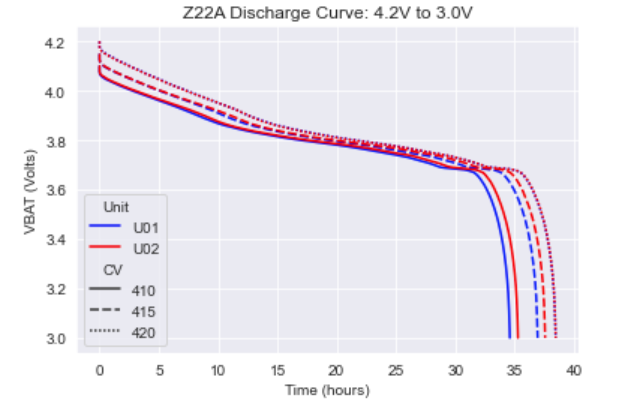
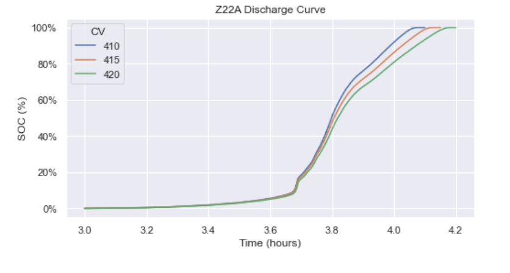

# Quick Look Battery Discharge Report

This Jupyter notebook provides the minimum required initial analysis for a set of battery tests performed using a Maccor battery tester. This analysis nominal current results:

* Discharge curves
* State of Charge (SOC) curves
* Discharge capacities

# Requirements

## File Name Structure

The file names are assumed to have the following syntax: 
<Tester Initials:2 char>_U<Test Item Number: 2 char>_M<Battery Model: 4 char>_D<Test description: N char>

The batteries' test item number and description will be included with the test result data frame. This allows for convenient grouping and graphing.

## Maccor Output File Structure

The Maccor file structure contains many fields:

1. Rec#: Simple integer index
1. Cyc#: Each cycle consistes of a series of steps.
1. Step: Consists of charge, discharge, pause, and iterate steps.
1. TestTime: Absolute increment of time in Maccor custom format
1. StepTime: Time in each step
1. Amp-hr: The total charge into/out of the battery – depending on step
1. Watt-hr: Energy associated with charge/discharge current
1. Amps: Charge/discharge current (depends on phase)
1. Volts: Battery voltage
1. State: Letter designation of the battery state (C=charge, D=discharge)
1. ES: Unknown
1. DPt Time
1. ACImp/Ohms: AC impedance at 1 kHz
1. DCIR/Ohms; DC resistance
1. VAR1 .. VAR15: User defineable fields

# Analysis Data

## Data Dictionary

The notebook cleans the data and produces a data table with the following data:

* Time (minutes)
* Charge (mAh)
* Battery Voltage (V)
* Battery Model
* Unit Number

## Discharge Curves

## SOC Curves

